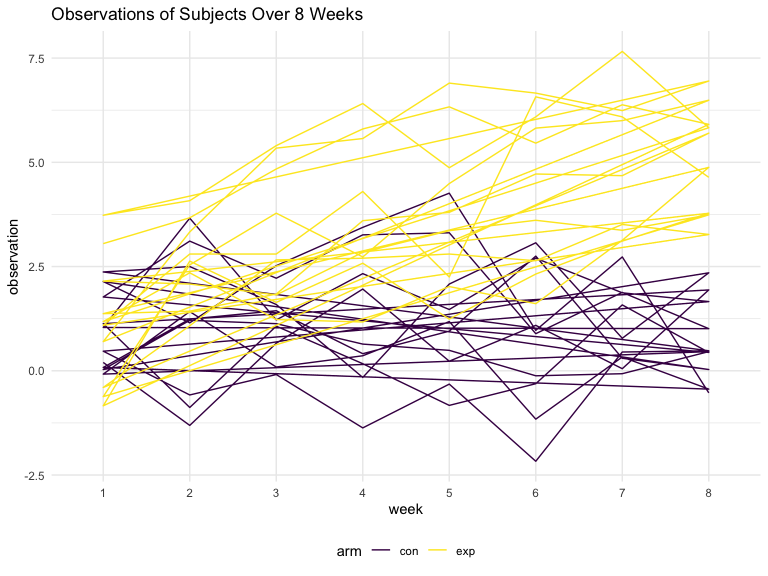
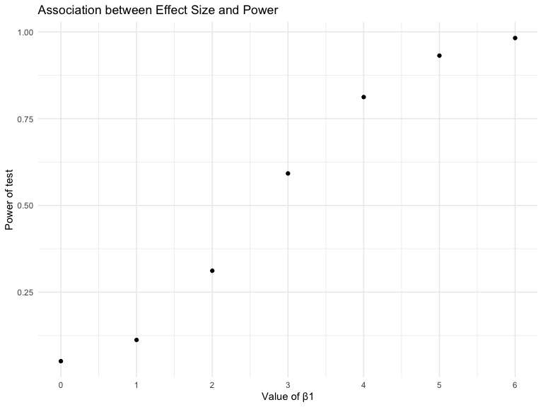
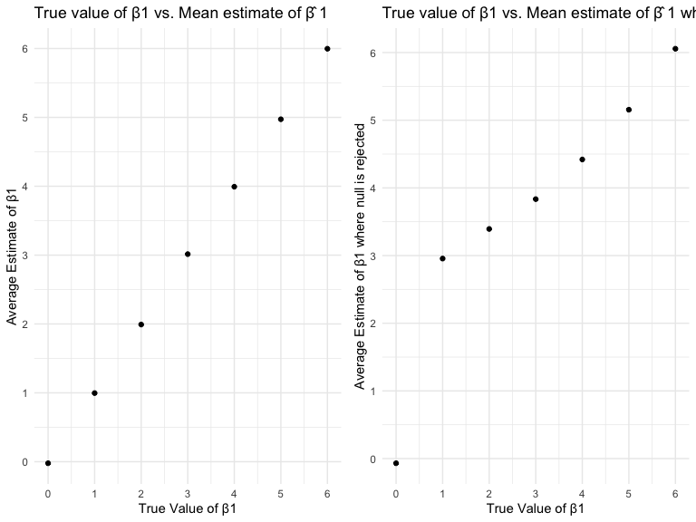

p8105\_hw5\_stl2137
================

## Problem 1

``` r
set.seed(10)

iris_with_missing = iris %>% 
  map_df(~replace(.x, sample(1:150, 20), NA)) %>%
  mutate(Species = as.character(Species))
```

``` r
fill_iris <- function(x) {
  if(is.character(x)) {
    replace(x, is.na(x), "virginica")
  } else if(is.numeric(x)) {
    replace(x, is.na(x), mean(x, na.rm = TRUE))
  }
}

filled_iris <- map_df(.x = iris_with_missing, ~fill_iris(.x))
```

## Problem 2

``` r
long_study_tidy <- list.files(path = "./data/", pattern = "*.csv", full.names = TRUE) %>% 
  map_df(~read_csv(.)) %>% 
  mutate(
    subject_id = list.files("./data") %>% str_extract('.*(?=\\.csv$)')
  ) %>% 
  separate(subject_id, into = c("arm", "subject_number_id"), sep = "_") %>% 
  pivot_longer(
    week_1:week_8,
    names_to = "week",
    names_prefix = "week_",
    values_to = "observation"
  ) %>% 
  mutate(
    observation = as.numeric(observation)
  ) 
```

    ## Parsed with column specification:
    ## cols(
    ##   week_1 = col_double(),
    ##   week_2 = col_double(),
    ##   week_3 = col_double(),
    ##   week_4 = col_double(),
    ##   week_5 = col_double(),
    ##   week_6 = col_double(),
    ##   week_7 = col_double(),
    ##   week_8 = col_double()
    ## )
    ## Parsed with column specification:
    ## cols(
    ##   week_1 = col_double(),
    ##   week_2 = col_double(),
    ##   week_3 = col_double(),
    ##   week_4 = col_double(),
    ##   week_5 = col_double(),
    ##   week_6 = col_double(),
    ##   week_7 = col_double(),
    ##   week_8 = col_double()
    ## )
    ## Parsed with column specification:
    ## cols(
    ##   week_1 = col_double(),
    ##   week_2 = col_double(),
    ##   week_3 = col_double(),
    ##   week_4 = col_double(),
    ##   week_5 = col_double(),
    ##   week_6 = col_double(),
    ##   week_7 = col_double(),
    ##   week_8 = col_double()
    ## )
    ## Parsed with column specification:
    ## cols(
    ##   week_1 = col_double(),
    ##   week_2 = col_double(),
    ##   week_3 = col_double(),
    ##   week_4 = col_double(),
    ##   week_5 = col_double(),
    ##   week_6 = col_double(),
    ##   week_7 = col_double(),
    ##   week_8 = col_double()
    ## )
    ## Parsed with column specification:
    ## cols(
    ##   week_1 = col_double(),
    ##   week_2 = col_double(),
    ##   week_3 = col_double(),
    ##   week_4 = col_double(),
    ##   week_5 = col_double(),
    ##   week_6 = col_double(),
    ##   week_7 = col_double(),
    ##   week_8 = col_double()
    ## )
    ## Parsed with column specification:
    ## cols(
    ##   week_1 = col_double(),
    ##   week_2 = col_double(),
    ##   week_3 = col_double(),
    ##   week_4 = col_double(),
    ##   week_5 = col_double(),
    ##   week_6 = col_double(),
    ##   week_7 = col_double(),
    ##   week_8 = col_double()
    ## )
    ## Parsed with column specification:
    ## cols(
    ##   week_1 = col_double(),
    ##   week_2 = col_double(),
    ##   week_3 = col_double(),
    ##   week_4 = col_double(),
    ##   week_5 = col_double(),
    ##   week_6 = col_double(),
    ##   week_7 = col_double(),
    ##   week_8 = col_double()
    ## )
    ## Parsed with column specification:
    ## cols(
    ##   week_1 = col_double(),
    ##   week_2 = col_double(),
    ##   week_3 = col_double(),
    ##   week_4 = col_double(),
    ##   week_5 = col_double(),
    ##   week_6 = col_double(),
    ##   week_7 = col_double(),
    ##   week_8 = col_double()
    ## )
    ## Parsed with column specification:
    ## cols(
    ##   week_1 = col_double(),
    ##   week_2 = col_double(),
    ##   week_3 = col_double(),
    ##   week_4 = col_double(),
    ##   week_5 = col_double(),
    ##   week_6 = col_double(),
    ##   week_7 = col_double(),
    ##   week_8 = col_double()
    ## )
    ## Parsed with column specification:
    ## cols(
    ##   week_1 = col_double(),
    ##   week_2 = col_double(),
    ##   week_3 = col_double(),
    ##   week_4 = col_double(),
    ##   week_5 = col_double(),
    ##   week_6 = col_double(),
    ##   week_7 = col_double(),
    ##   week_8 = col_double()
    ## )
    ## Parsed with column specification:
    ## cols(
    ##   week_1 = col_double(),
    ##   week_2 = col_double(),
    ##   week_3 = col_double(),
    ##   week_4 = col_double(),
    ##   week_5 = col_double(),
    ##   week_6 = col_double(),
    ##   week_7 = col_double(),
    ##   week_8 = col_double()
    ## )
    ## Parsed with column specification:
    ## cols(
    ##   week_1 = col_double(),
    ##   week_2 = col_double(),
    ##   week_3 = col_double(),
    ##   week_4 = col_double(),
    ##   week_5 = col_double(),
    ##   week_6 = col_double(),
    ##   week_7 = col_double(),
    ##   week_8 = col_double()
    ## )
    ## Parsed with column specification:
    ## cols(
    ##   week_1 = col_double(),
    ##   week_2 = col_double(),
    ##   week_3 = col_double(),
    ##   week_4 = col_double(),
    ##   week_5 = col_double(),
    ##   week_6 = col_double(),
    ##   week_7 = col_double(),
    ##   week_8 = col_double()
    ## )
    ## Parsed with column specification:
    ## cols(
    ##   week_1 = col_double(),
    ##   week_2 = col_double(),
    ##   week_3 = col_double(),
    ##   week_4 = col_double(),
    ##   week_5 = col_double(),
    ##   week_6 = col_double(),
    ##   week_7 = col_double(),
    ##   week_8 = col_double()
    ## )
    ## Parsed with column specification:
    ## cols(
    ##   week_1 = col_double(),
    ##   week_2 = col_double(),
    ##   week_3 = col_double(),
    ##   week_4 = col_double(),
    ##   week_5 = col_double(),
    ##   week_6 = col_double(),
    ##   week_7 = col_double(),
    ##   week_8 = col_double()
    ## )
    ## Parsed with column specification:
    ## cols(
    ##   week_1 = col_double(),
    ##   week_2 = col_double(),
    ##   week_3 = col_double(),
    ##   week_4 = col_double(),
    ##   week_5 = col_double(),
    ##   week_6 = col_double(),
    ##   week_7 = col_double(),
    ##   week_8 = col_double()
    ## )
    ## Parsed with column specification:
    ## cols(
    ##   week_1 = col_double(),
    ##   week_2 = col_double(),
    ##   week_3 = col_double(),
    ##   week_4 = col_double(),
    ##   week_5 = col_double(),
    ##   week_6 = col_double(),
    ##   week_7 = col_double(),
    ##   week_8 = col_double()
    ## )
    ## Parsed with column specification:
    ## cols(
    ##   week_1 = col_double(),
    ##   week_2 = col_double(),
    ##   week_3 = col_double(),
    ##   week_4 = col_double(),
    ##   week_5 = col_double(),
    ##   week_6 = col_double(),
    ##   week_7 = col_double(),
    ##   week_8 = col_double()
    ## )
    ## Parsed with column specification:
    ## cols(
    ##   week_1 = col_double(),
    ##   week_2 = col_double(),
    ##   week_3 = col_double(),
    ##   week_4 = col_double(),
    ##   week_5 = col_double(),
    ##   week_6 = col_double(),
    ##   week_7 = col_double(),
    ##   week_8 = col_double()
    ## )
    ## Parsed with column specification:
    ## cols(
    ##   week_1 = col_double(),
    ##   week_2 = col_double(),
    ##   week_3 = col_double(),
    ##   week_4 = col_double(),
    ##   week_5 = col_double(),
    ##   week_6 = col_double(),
    ##   week_7 = col_double(),
    ##   week_8 = col_double()
    ## )

  - The experimental group over the 8 weeks have a trend of increasing
    observations compared with the control group observations over the 8
    weeks.

<!-- end list -->

``` r
long_study_tidy %>% 
  group_by(arm, subject_number_id) %>% 
  ggplot(aes(x = week, y = observation, group = arm, color = arm)) +
  geom_path() +
  labs(
    title = "Observations of Subjects Over 8 Weeks"
  )
```



## Problem 3

``` r
sim_regression = function(beta1) {
  
  sim_data = tibble(
    x = rnorm(30, mean = 0, sd = 1),
    y = 2 + beta1 * x + rnorm(30, 0, sqrt(50))
  )
  
  ls_fit = lm(y ~ x, data = sim_data)
  
  tibble(
    term = pull(broom::tidy(ls_fit), term),
    beta1_hat = pull(broom::tidy(ls_fit), estimate),
    p_value = pull(broom::tidy(ls_fit), p.value)
  )
}

sim_regression(0)
```

    ## # A tibble: 2 x 3
    ##   term        beta1_hat p_value
    ##   <chr>           <dbl>   <dbl>
    ## 1 (Intercept)      3.76  0.0156
    ## 2 x                2.02  0.207

``` r
sim_results_0 <- 
  rerun(10000, sim_regression(0)) %>% 
  bind_rows() %>% 
  filter(term %in% "x")
```

``` r
output = vector("list", length = 7)

for (i in 1:7) {
  
  output[[i]] = rerun(10000, sim_regression(i-1)) %>% 
    bind_rows() %>% 
    mutate(
      beta1_group = i-1
    )
}

sim_results_0_6 <- 
  output %>% 
  bind_rows() %>% 
  filter(term %in% "x")
```

``` r
sim_results_0_6 %>% 
  filter(p_value < 0.05) %>% 
  group_by(beta1_group) %>% 
  summarise(proportion = n()/10000) %>% 
  ggplot(aes(x = beta1_group, y = proportion)) +
  geom_point() +
  labs(
    title = "Association between Effect Size and Power",
    x = "Value of β1",
    y = "Power of test"
  ) +
  scale_x_continuous(breaks = 0:6)
```



  - As the value of β1 increased, the power of the test also increased.

<!-- end list -->

``` r
beta_hat_vs_true <- sim_results_0_6 %>% 
  group_by(beta1_group) %>% 
  summarise(
    avg_est_beta1 = mean(beta1_hat)) %>% 
  ggplot(aes(x = beta1_group, y = avg_est_beta1)) +
  geom_point() +
  labs(
    title = "True value of β1 vs. Mean estimate of β̂ 1  ",
    x = "True Value of β1",
    y = "Average Estimate of β1"
  ) +
  scale_x_continuous(breaks = 0:6) +
  scale_y_continuous(breaks = 0:6)

null_rejected_beta_hat_vs_true <- sim_results_0_6 %>% 
  filter(p_value < 0.05) %>% 
  group_by(beta1_group) %>% 
  summarise(
    avg_est_beta1 = mean(beta1_hat)) %>% 
  ggplot(aes(x = beta1_group, y = avg_est_beta1)) +
  geom_point() +
  labs(
    title = "True value of β1 vs. Mean estimate of β̂ 1 where null is rejected ",
    x = "True Value of β1",
    y = "Average Estimate of β1 where null is rejected"
  ) +
  scale_x_continuous(breaks = 0:6) +
  scale_y_continuous(breaks = 0:6)

beta_hat_vs_true + null_rejected_beta_hat_vs_true
```



The sample average of beta hat1 across tests for which the null is
rejected is not equal to the true values of beta1. Because we filter for
beta hat values where the null is rejected, the average of these beta
hats is skewed since the lower true values of beta1 have lower power as
shown previously. Lower power increases the probability of committing a
type 2 error.
